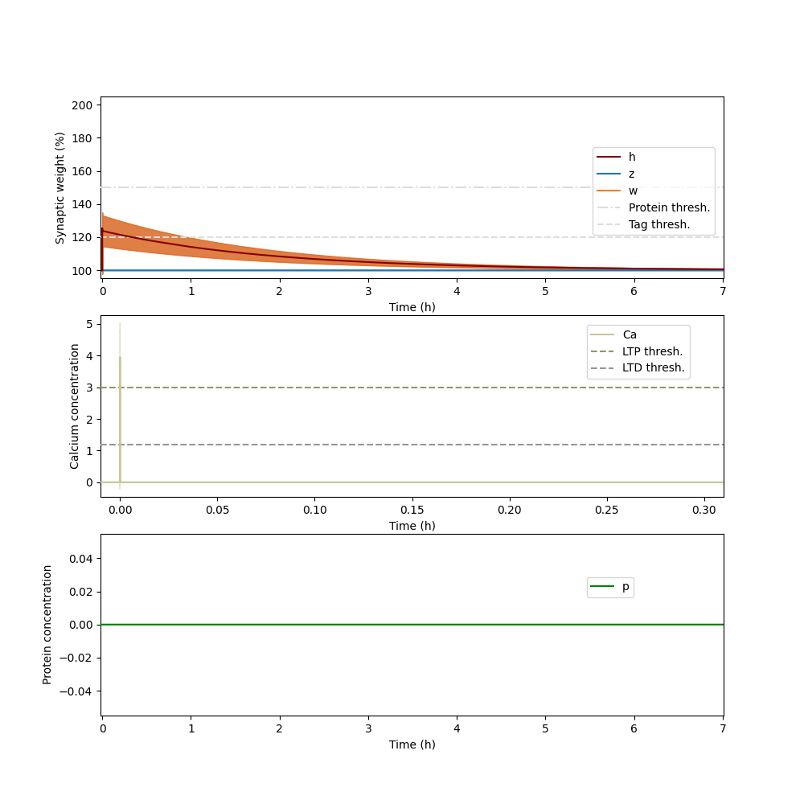
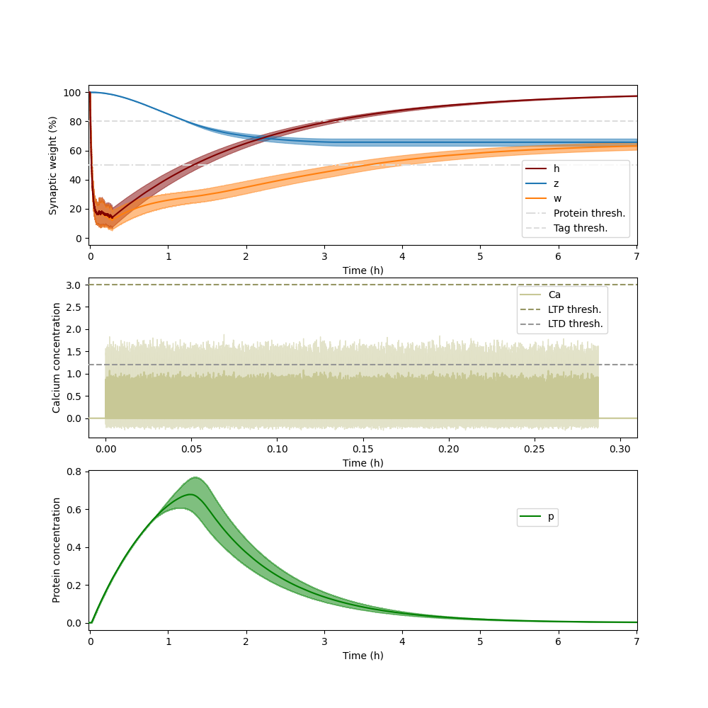
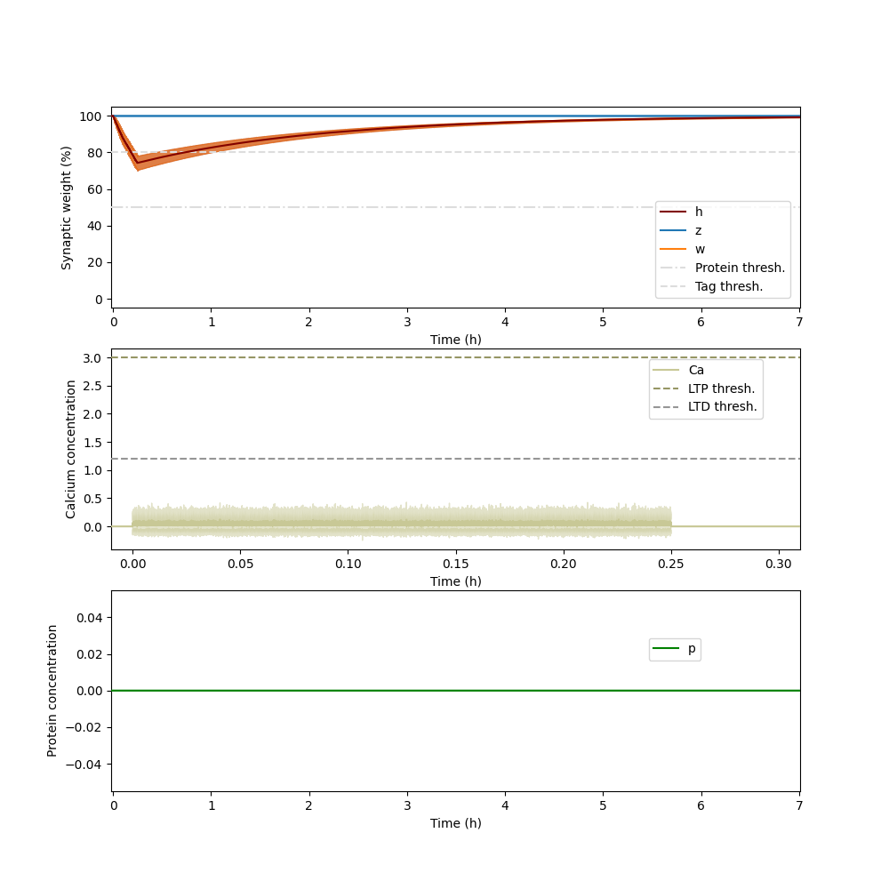

# Arbor simulation of the induction of early- and late-phase plasticity at a single synapse

This code simulates a current-based, plastic synapse that connects two leaky integrate-and-fire neurons. The synapse model reproduces the outcome of established plasticity-inducing protocols by featuring early-phase plasticity based on calcium dynamics and late-phase plasticity based on synaptic tagging and capture.
 
It has been tested with [Arbor](https://arbor-sim.org/) version 0.8.1.

 The following protocols are provided and can be run by the bash scripts of the same name:
 * "run\_arbor\_basic\_early": demonstrates the simulation of basic calcium and early-phase plasticity dynamics. The presynaptic neuron spikes at predefined times and thereby stimulates the postsynaptic site and induces plasticity.
 * "run\_arbor\_classical\_protocols": reproduces classical induction protocols for early- and late-phase long-term potentiation and depression. The presynaptic neuron spikes in a Poissonian manner according to one of the protocols \{STET, WTET, SLFS, WLFS\}, thereby stimulating the postsynaptic site and inducing plasticity.

The underlying synapse and neuron model has been described in detail in [Luboeinski \& Tetzlaff, 2021](https://doi.org/10.1038/s42003-021-01778-y).

## Basic early-phase dynamics
Noise in plasticity generated from seed 0:

No noise in plasticity:

## Classical plasticity-inducing protocols
For details see, for example, [Sajikumar et al., 2005](https://doi.org/10.1523/JNEUROSCI.1104-05.2005) or [Luboeinski \& Tetzlaff, 2021](https://doi.org/10.1038/s42003-021-01778-y).

STET:

WTET:

SLFS:

WLFS:

